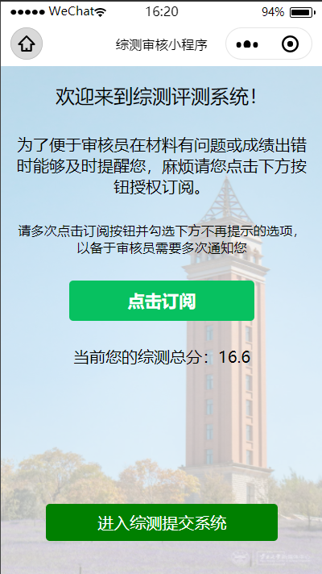
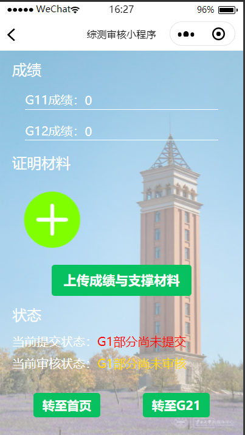
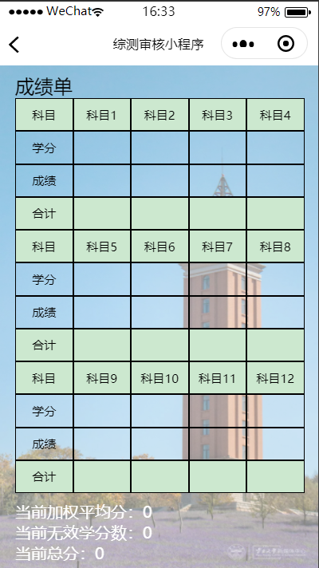
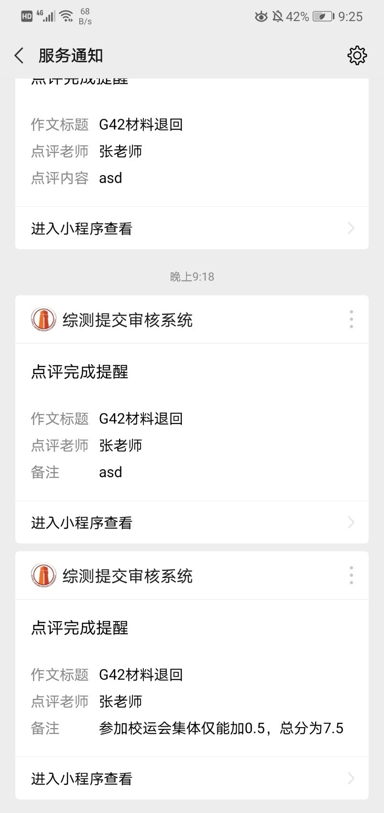

# 项目名称  

综测审核小程序  

## 项目介绍  

本项目旨在解决同学们每学年综合成绩测评时繁琐的分数计算问题。

传统的综合测评成绩计算时，需对每一项的成绩进行准确计算最后得出最终成绩，但由于人总有疏忽，难免会算错某一项，最后导致总成绩出错时又要重新计算。同时对应成绩的证明材料却要分开提交也增加了老师、同学的麻烦。

本项目打破传统方式，分项目进行成绩提交和审核，对应材料和证明在一起提交，并且只需填写各项目对应的成绩，不需自己折合成绩。同时各科成绩折合时只需填写相应的成绩与学分，本程序会自动算出相应成绩、折合成绩，最后按各项成绩比重进行折合算出总成绩。而且同学们还可以通过微信推送接收到审核反馈。

## 项目效果  

​      学生成绩提交首页，点击订阅授权可实现消息推送。  

​      各项成绩、材料提交

​    填写各科成绩，自动计算对应成绩

​      老师审核端审核各项，点击预览图可放大  

​       订阅实现消息推送

## 项目体验  

##### 项目体验小程序二维码  

## 部署教程  

### Q & A  

##### 如何下载代码?

> 点击[下载地址](https://github.com/loveleaves/loveleaves-wechat_miniprogram_The-Comprehensive-evalution/archive/master.zip)，即可下载。

##### 如何将代码导入到开发者工具？

> 进入小程序开发者工具，点击左侧小程序，再点击右侧 ‘+’ 号，然后在右侧上面选中导入项目选中刚才下载的压缩包解压后的文件夹，AppID填写你自己的，后端服务选择 ‘小程序 云开发’，点击确认即可导入。

> 详细步骤见[部署说明](deployment.md)

##### 哪些参数需要修改？

> 在导入的项目中查找app.js，把env（环境）后面单引号括住的内容改成你自己的环境ID即可。

##### 哪些云函数需要部署？

> cloud文件夹下函数都要创建并部署。（包含 getOpenid、modification、remove、sendToWeChat)

##### 涉及到的外部服务?

> 无

##### 云数据库中需要创建哪些数据?

> 需在云数据库中添加集合admin_info、login_info、submit、submit1、submit2、submit3、submit4、submit5、submit6 。

##### 云存储中需要上传哪些文件？

> 无需上传文件。

##### 后台需要配置哪些服务？

> 无

## 开源许可证标注  

详见[LICENSE](https://github.com/loveleaves/wechat_miniprogram_The-Comprehensive-evalution/blob/master/LICENSE)
