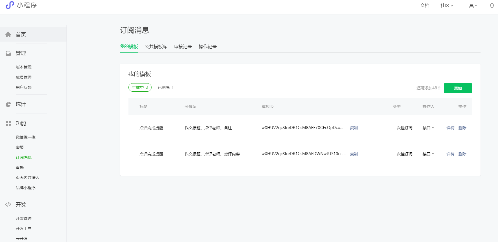
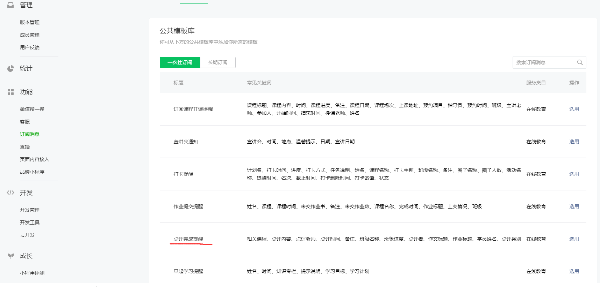

# 项目名称  

综测审核小程序  

## 项目介绍  

### 设计背景

> 综测素质测评，简称“综测”，是评定学生水平的一个重要方式。综测成绩的评比涉及到学生生活中的的方面，学生需要整理上一学年包括学习成绩、实践实习、文体活动、比赛竞赛等一系列材料，最终由选举出的综测小组进行审核并确定成绩。由于综合测评牵扯到奖学金，保研名额等一系列非常重要的事件，因此审核部分便显得尤为重要，零点几分之差便可能涉及到保研名额的变动；而目前信息学院的综测审核均采用纸质审核方式，且由于时间较为紧张，综测审核往往在一至两天内完成。紧张的时间以及茫茫多的材料无疑给综测小组的审核带来了麻烦，并且也很容易造成审核中的失误。造成的失误会影响到评审的公平性与透明度，导致同学们质疑审核结果的真实性。为了解决时间与空间上的双重压力，我们设计了该小程序，以帮助综测小组保质保量的完成审核。

### 设计思路

> 我们的设计思路从广度上满足了提交方与审核方的需求，从深度上满足了空间与时间匮乏的需求，同时解决了审核过程中公平度的问题。

1. 从提交方来说，由于综合测评整体上分为四个模块，细分又可以分为七个模块，因此我们就七个模块下手，一旦提交方准备好某一模块的材料并计算好该模块成绩，便可选中该模块进行提交，此后仅需等待审核方审核即可。从时间上由于分模块进行提交，避免在短时间内准备大量材料可能造成的疏漏；从空间上由于采用拍照上传至云数据库的方式，减少了提交方丢失材料的风险，并且审核通过后材料便可以丢弃，节省了保存的精力。
2. 从审核方来说，同样采用以上思路，分七个模块进行设计，只要有提交方提交了某模块的相关成绩与支撑材料，审核方便可进行审核。如果出现差错，也可以通过微信的推送即时提醒提交方。从时间上由于不需要集中于某天审核大量材料，因此大大减少了审核压力与出错概率，在空闲时即可进行审核；从空间上由于不需要阅览大批材料，且分模块进行审核，因此在审核时可以分工审核，既可以提高效率，也可以减少出错的概率，同时避免了材料遗失、混乱等情况。与此同时，为了便于在审核过后将所有人成绩导出，在审核端入口处便设有导出按钮，随时都可以查看当前的成绩与审核进度。
3. 从提交方与审核方都注重的公平性来说，在审核端我们设计了双重审核制度，仅有两位审核员均审核通过后才允许通过，大大提升了审核的公平度。并且在审核时，审核者的姓名会添加入数据库中，一旦同学有异议，便可以找到对应的审核者，防止无据可查、无证可依。审核不通过时，在发送的订阅消息中附带审核者姓名及理由，可以轻松的得知原因并及时修正。

## 项目效果  

​      学生成绩提交首页，点击订阅授权可实现消息推送。  

​      各项成绩、材料提交

​    填写各科成绩，自动计算对应成绩

​      老师审核端审核各项，点击预览图可放大  

​       订阅实现消息推送

## 项目体验  

##### 项目体验小程序二维码  

## 部署教程  

### Q & A  

##### 如何下载代码?

> 点击[下载地址](https://github.com/loveleaves/wechat_miniprogram_The-Comprehensive-evalution/archive/master.zip)，即可下载。

##### 如何将代码导入到开发者工具？

> 进入小程序开发者工具，点击左侧小程序，再点击右侧 ‘+’ 号，然后在右侧上面选中导入项目选中刚才下载的压缩包解压后的文件夹，AppID填写你自己的，后端服务选择 ‘小程序 云开发’，点击确认即可导入。

> 详细步骤见[部署说明](./deployment.md)

##### 哪些参数需要修改？

> 在导入的项目中查找app.js，把env（环境）后面单引号括住的内容改成你自己的环境ID,然后以同样的方法把cloud文件夹内所有的云函数的js文件里env替换掉，最后修改云函数sendToWeChat的index.js文件里的templateId（详细请看下面后台[需要配置哪些服务](#jump)）。

##### 哪些云函数需要部署？

> - cloud文件夹下函数都要创建并部署。（包含 getOpenid、excel、getData、modification、remove、sendToWeChat)
>
> - node-xlsx库。
>
>   > 如果部署不成功，请右键点击excel云函数，在终端打开，然后输入以下两条语句：
>   >
>   > npm config set registry 
>   >
>   > npm install node-xlsx

##### 涉及到的外部服务?

> 无

##### 云数据库中需要创建哪些数据?

> 需在云数据库中添加集合admin_info、login_info、submit、submit1、submit2、submit3、submit4、submit5、submit6 。

##### 云存储中需要上传哪些文件？

> 无需上传文件。

##### 后台需要配置哪些服务?

*需要配置微信的订阅消息功能*

1. 进入[微信小程序官网](https://mp.weixin.qq.com/),登陆自己的微信账号。
2. 点击进入功能=>订阅消息模块
3.  点击进入公共模板库=>一次性订阅页面，选用点评完成提醒模板
4. 填写如下信息，点击提交。
5. 点击我的模板=>生效中，复制下面你刚才创建的那个模板的id复制粘贴到云函数sendTowechat的index.js文件的templateID后，即把templateID后内容改成你的模板ID即可。 

## 开源许可证标注  

采用  [MIT LICENSE](./LICENSE)。

