# 部署说明

1、下载该压缩包并解压，[点击下载](https://github.com/loveleaves/wechat_miniprogram_The-Comprehensive-evalution/archive/master.zip)。

2、打开微信开发者工具，选择左上角项目—导入项目，目录选择为解压的路径，AppID需要在微信公众平台—开发—开发设置中获取。

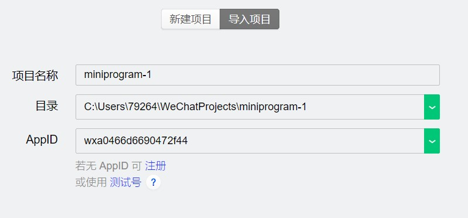

3、打开位于miniprogram/pages中的app.js文件，将env更换为自己云开发的环境ID。

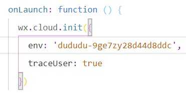

4、打开云开发中的数据库，点击左上角集合名称右边的加号，添加程序所必要的集合，其名称分别为：admin_info、login_info、submit、submit1、submit2、submit3、submit4、submit5、submit6。

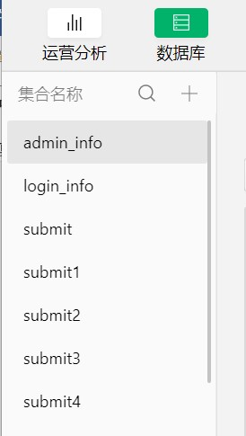

5、选择刚刚建立的数据库，在页面中央选择数据权限，将数据库权限全部设置为所有用户可读，仅创建者可读写。

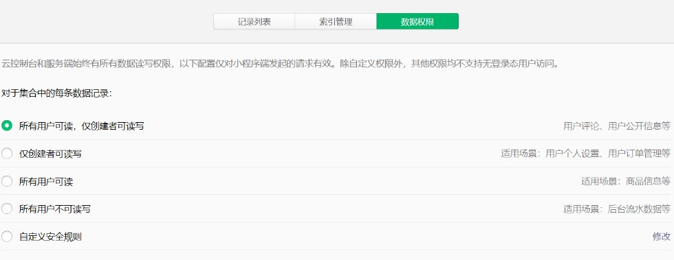

6、选择admin_info数据库，选择页面偏左的添加记录，选择添加一个新记录后确定。

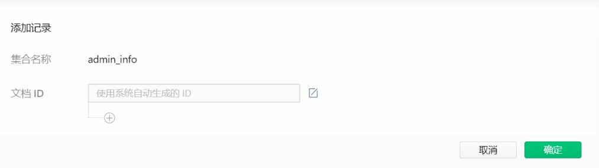

7、选择页面中央的添加字段，分别添加schoolnumber，username，pass1字段key，value根据个人习惯设置，建议账号密码均设置为六个1。该账号密码为登录审核端的账号密码。

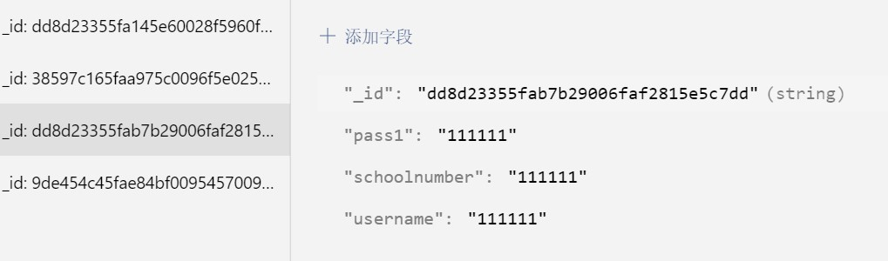

8、后台还需配置以下服务服务：微信的订阅消息功能。

- 1. 进入[微信小程序官网](https://mp.weixin.qq.com/),登陆自己的微信账号。

- 2. 点击进入功能=>订阅消息模块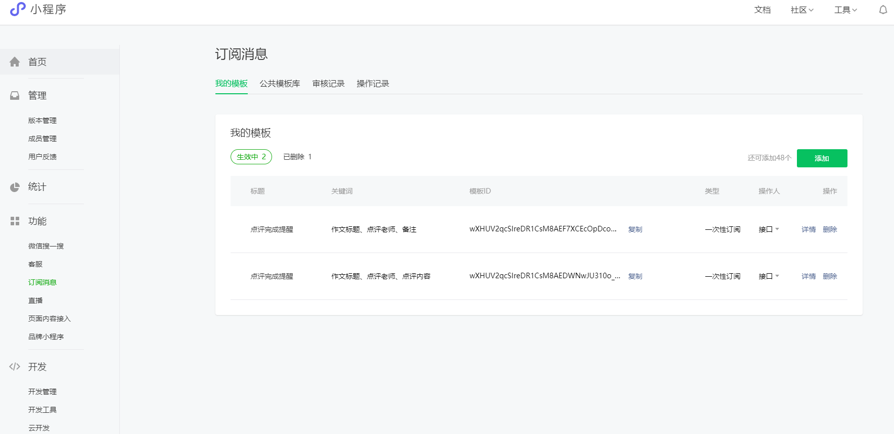

- 3. 点击进入公共模板库=>一次性订阅页面，选用点评完成提醒模板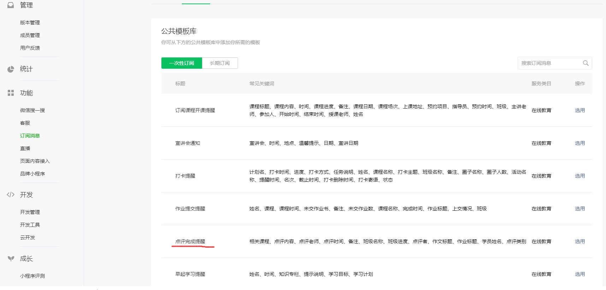

- 4. 填写如下信息，点击提交。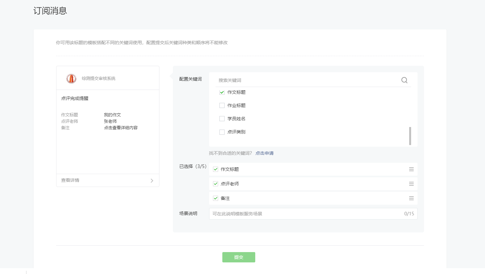

- 5. 点击我的模板=>生效中，复制下面你刚才创建的那个模板的id复制粘贴到云函数sendTowechat的index.js文件的templateID后，即把templateID后内容改成你的模板ID即可。 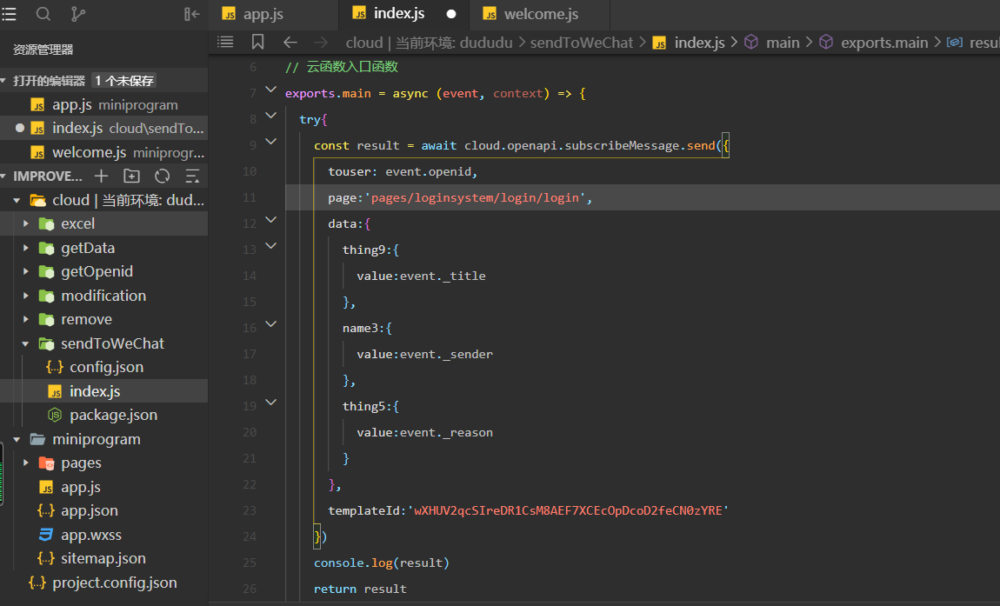

9、右键点击cloud文件夹中的六个文件夹，点击上传并部署：云端安装依赖，以部署六个云函数。其名称分别为getOpenid、modification、remove与sendToWeChat、excel、getData。云函数部署完毕可能需要时间，一般来说部署完毕后五分钟后可以使用。

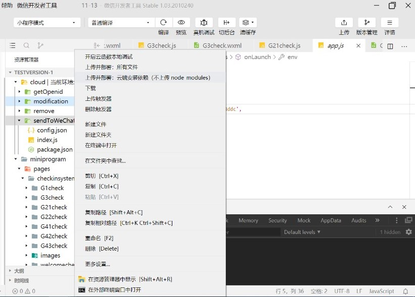

10、接下来就可以编译并使用了。